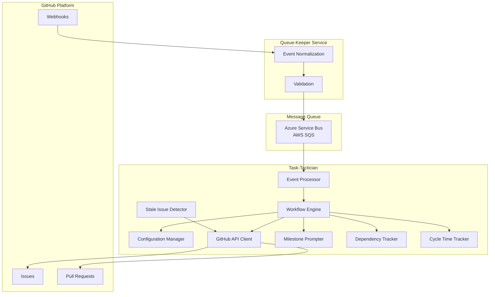

# Task-Tactician Architecture Specification

**Version**: 1.0
**Status**: Draft
**Last Updated**: October 24, 2025

## Purpose

This specification defines the architecture for **Task-Tactician**, a GitHub bot that automates work item triage and branch creation. Task-Tactician processes normalized GitHub webhook events from Queue-Keeper and executes workflow automation rules.

## System Context

Task-Tactician operates as an event-driven service that:

1. **Receives Events**: Consumes normalized GitHub webhook events via Azure Service Bus (or AWS SQS)
2. **Applies Rules**: Executes workflow logic for issue triage and lifecycle management
3. **Orchestrates Actions**: Creates branches, applies labels, manages issue-PR relationships
4. **Maintains Idempotency**: Ensures safe event replay and retry without side effects

**Primary Use Cases**:

- Automatically create feature branches when issues move to "in progress"
- Apply and update workflow labels based on issue state transitions
- Monitor PR events and apply "has-pr" labels to issues based on GitHub's native linking
- Track issue lifecycle from creation through completion
- Ensure ordered event processing per repository to maintain consistency

## Architecture Overview

## Document Structure

This specification is organized into focused documents, each addressing a specific architectural concern:

### Core Architecture Documents

| Document | Purpose |
|----------|---------|
| [overview.md](overview.md) | System context, constraints, and high-level design |
| [vocabulary.md](vocabulary.md) | Domain concepts and terminology |
| [responsibilities.md](responsibilities.md) | Component responsibilities using RDD (Responsibility-Driven Design) |
| [architecture.md](architecture.md) | Clean architecture boundaries and dependencies |
| [assertions.md](assertions.md) | Behavioral specifications and testable requirements |

### Supporting Documents

| Document | Purpose |
|----------|---------|
| [operations.md](operations.md) | Deployment, monitoring, scaling, and observability |
| [testing.md](testing.md) | Testing strategy and coverage requirements |
| [security.md](security.md) | Security model, threats, and mitigations |
| [edge-cases.md](edge-cases.md) | Non-standard flows and error scenarios |
| [tradeoffs.md](tradeoffs.md) | Architectural decisions and alternatives considered |
| [constraints.md](constraints.md) | Implementation constraints and rules |

## Workflow to Interface Designer

This architecture specification establishes:

1. **Logical Boundaries**: Business logic vs. external system interfaces vs. infrastructure
2. **Domain Vocabulary**: Core concepts and their relationships
3. **Behavioral Contracts**: What the system must do (assertions)
4. **Component Responsibilities**: What each component knows and does
5. **Error Handling Strategy**: How failures are categorized and handled

The **Interface Designer** will use this specification to:

- Define concrete types for domain concepts (Issue, PullRequest, WorkflowEvent, etc.)
- Create interface abstractions for external dependencies (GitHub API, Message Queue, Configuration Store)
- Generate typed stubs organized by business domain (not architectural layers)
- Establish module boundaries following language conventions

## Key Architectural Decisions

### 1. Event-Driven Architecture

- All operations triggered by GitHub events via message queue
- Ordered processing per repository to maintain consistency
- At-least-once delivery with idempotent handlers

### 2. Stateless Design

- GitHub serves as source of truth
- No persistent state storage required
- Configuration cached with TTL

### 3. Clean Architecture with Dependency Inversion

- Business logic depends only on abstractions
- Infrastructure implements interfaces defined by business needs
- Testable without external dependencies

### 4. Result-Based Error Handling

- Expected errors are values (Result type), not exceptions
- Exceptions only for unexpected/unrecoverable failures
- All error types include context for debugging

### 5. Multi-Tenant with Configuration Hierarchy

- Supports multiple organizations and repositories
- Repository-level config overrides organization defaults
- System defaults embedded in application

### 6. Enhanced Workflow Features (MVP)

- **Stale issue detection**: Automatically labels inactive issues for triage
- **Milestone prompting**: Suggests milestone assignment on issue creation
- **Dependency tracking**: Parses and tracks issue dependencies for planning
- **Cycle time analytics**: Records metrics for velocity tracking and improvement

## Success Criteria

This architecture succeeds when:

1. **Event Processing**: Processes events with <5s P95 latency
2. **Idempotency**: Same event processed multiple times produces identical results
3. **Reliability**: Gracefully handles transient failures with retry logic
4. **Observability**: All operations logged with correlation for debugging
5. **Testability**: Business logic achievable >90% unit test coverage
6. **Maintainability**: Clear boundaries enable independent component evolution

## Next Steps

1. **Review** this specification for completeness and clarity
2. **Interface Designer** creates concrete types and interfaces
3. **Planner** breaks work into implementable tasks
4. **Coder** implements against defined interfaces

---

**Questions or Feedback**: Direct to specification review process
