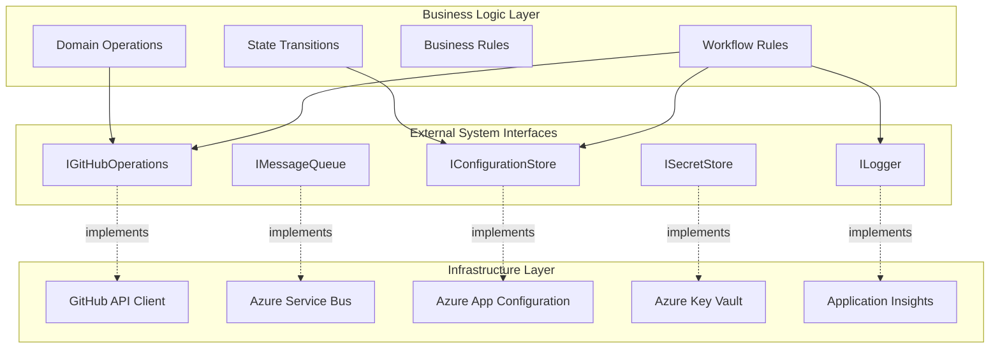
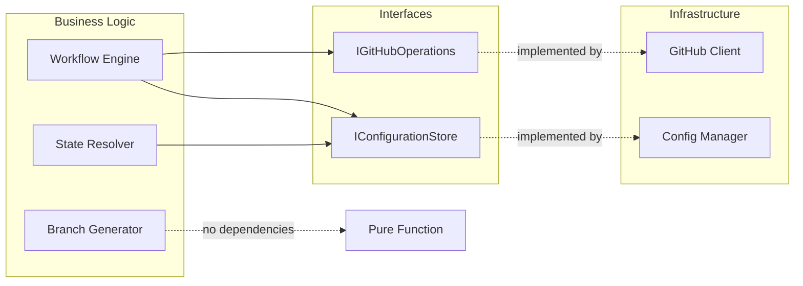

# Clean Architecture

This document defines Task-Tactician's architecture using Clean Architecture principles, establishing clear boundaries between business logic, external system interfaces, and infrastructure implementations.

## Architectural Layers



## Business Logic Layer

The business logic layer contains domain concepts and operations that are independent of any framework or infrastructure.

### Domain Concepts

Core types representing business entities:

- **WorkflowEvent**: Normalized GitHub event requiring processing
- **Issue**: Work item with lifecycle state
- **PullRequest**: Code change proposal linked to issues
- **Branch**: Git branch for development work
- **WorkflowState**: Issue lifecycle phase (Open, InProgress, HasPR, Done)
- **WorkflowAction**: Discrete operation (CreateBranch, ApplyLabel, etc.)
- **RepositoryConfig**: Workflow behavior settings

### Business Operations

Core operations that embody workflow rules:

#### Issue Workflow Processing

**Operation**: `process_issue_event(event: WorkflowEvent) -> Result<Vec<WorkflowAction>, WorkflowError>`

**Business Rules**:

1. Issue transitions to InProgress when labeled `in-progress` OR moved to "In Progress" project column
2. Branch creation triggers only on InProgress transition, not on assignment
3. Branch name follows pattern: `{prefix}/{issue-number}-{slug}`
4. Branch prefix determined by issue label mapping (bug → fix/, feature → feat/)
5. If no branch exists and issue is InProgress, create branch from default branch
6. Apply `in-progress` label if not already present
7. Log warning if milestone missing on InProgress transition

**Dependencies** (via interfaces):

- `IConfigurationStore::get_repository_config()` - retrieve workflow settings
- `IGitHubOperations::get_issue()` - fetch current issue state
- `IGitHubOperations::branch_exists()` - check branch existence
- `IGitHubOperations::get_repository_labels()` - discover available labels
- `ILogger::log_info/warn()` - record operations

#### PR Workflow Processing

**Operation**: `process_pr_event(event: WorkflowEvent) -> Result<Vec<WorkflowAction>, WorkflowError>`

**Business Rules**:

1. When PR is opened, detect GitHub-created links to issues via PR metadata
2. Apply "has-pr" label to all linked issues
3. When PR is closed or merged, remove "has-pr" label from linked issues
4. Only process PRs that have valid issue links
5. Validate linked issues exist before label application
6. Log PR-issue relationships for traceability

**Dependencies** (via interfaces):

- `IConfigurationStore::get_repository_config()` - retrieve label mappings
- `IGitHubOperations::get_pull_request()` - fetch PR data and linked issues
- `IGitHubOperations::apply_label()` - apply "has-pr" to issues
- `IGitHubOperations::remove_label()` - remove "has-pr" from issues
- `ILogger::log_info/warn()` - record operations

**Note**: Task-Tactician relies on GitHub's native PR-issue linking (via keywords like "closes #123" in PR descriptions). It does NOT create these links, but reacts to PR events to update issue workflow labels.

#### Label Discovery and Validation

**Operation**: `discover_workflow_labels(repository: RepositoryId, config: LabelConfig) -> Result<ValidatedLabelConfig, WorkflowError>`

**Business Rules**:

1. Query repository for all available labels
2. For each configured label (e.g., "in-progress", "blocked", "has-pr"):
   - Check if label exists in repository
   - If exists, use as configured
   - If not exists, fall back to system default label
3. For branch prefix mappings (bug → fix/, feature → feat/):
   - Discover labels matching type categories
   - Build mapping from discovered labels to prefixes
   - Use default prefix (feat/) for labels without mapping
4. Validate all required workflow labels exist (or have defaults)
5. Cache validated label configuration

**Dependencies** (via interfaces):

- `IGitHubOperations::get_repository_labels()` - fetch available labels
- `IConfigurationStore::get_repository_config()` - get label preferences
- `ILogger::log_info/warn()` - record label discovery

#### Branch Name Generation

**Operation**: `generate_branch_name(issue: Issue, config: BranchNamingConfig) -> Result<BranchName, ValidationError>`

**Business Rules**:

1. Extract issue number and title from issue
2. Determine prefix from issue labels using configured mappings
3. Use default prefix (`feat/`) if no label matches
4. Generate slug from title: lowercase, replace non-alphanumeric with hyphens, max 50 chars
5. Construct name: `{prefix}/{issue-number}-{slug}`
6. Validate total length ≤ 65 characters
7. Ensure slug doesn't end with hyphen

**Dependencies**: None (pure function)

#### State Resolution

**Operation**: `resolve_issue_state(issue: Issue, config: LabelConfig) -> WorkflowState`

**Business Rules**:

1. Check for `blocked` label first (highest precedence)
2. Check for `in-progress` label
3. Check for `has-pr` label
4. If issue closed, state is Done
5. Default to Open state if no other indicators

**Dependencies**: None (pure function)

### Error Handling Strategy

Business logic uses `Result<T, E>` type for expected errors:

**WorkflowError Types**:

- `ValidationError`: Input data fails validation (missing required field, invalid format)
- `BusinessRuleViolation`: Operation violates workflow rule (branch exists, missing milestone)
- `ConfigurationError`: Invalid or missing configuration
- `ExternalSystemError`: GitHub API or other external dependency failure

**Error Handling Principles**:

1. **Expected errors are values**: Returned as `Err(...)` in Result type
2. **Exceptions for unexpected failures**: Panic only on unrecoverable errors
3. **Error context required**: All errors include context for debugging
4. **Retry classification**: Errors marked as retryable or non-retryable

## External System Interfaces

Abstractions defining how business logic interacts with external systems. These interfaces are **owned by the business logic** and **implemented by infrastructure**.

### IGitHubOperations

Interface for GitHub API operations.

**Operations**:

```
trait IGitHubOperations {
    // Branch operations
    fn branch_exists(repository: RepositoryId, branch_name: BranchName) -> Result<bool, GitHubError>
    fn create_branch(repository: RepositoryId, branch_name: BranchName, source_ref: GitRef) -> Result<Branch, GitHubError>

    // Issue operations
    fn get_issue(repository: RepositoryId, issue_number: IssueNumber) -> Result<Issue, GitHubError>
    fn apply_label(repository: RepositoryId, issue_number: IssueNumber, label: LabelName) -> Result<(), GitHubError>
    fn remove_label(repository: RepositoryId, issue_number: IssueNumber, label: LabelName) -> Result<(), GitHubError>
    fn add_comment(repository: RepositoryId, issue_number: IssueNumber, comment: CommentText) -> Result<(), GitHubError>

    // Pull Request operations
    fn get_pull_request(repository: RepositoryId, pr_number: PRNumber) -> Result<PullRequest, GitHubError>
    fn get_linked_issues(repository: RepositoryId, pr_number: PRNumber) -> Result<Vec<IssueNumber>, GitHubError>

    // Label operations
    fn get_repository_labels(repository: RepositoryId) -> Result<Vec<Label>, GitHubError>
    fn label_exists(repository: RepositoryId, label_name: LabelName) -> Result<bool, GitHubError>

    // Repository operations
    fn get_default_branch(repository: RepositoryId) -> Result<BranchName, GitHubError>
    fn get_file_content(repository: RepositoryId, file_path: FilePath) -> Result<FileContent, GitHubError>
}
```

**Error Types**:

- `NotFound`: Resource does not exist (404)
- `Forbidden`: Insufficient permissions (403)
- `RateLimited`: API rate limit exceeded (429)
- `ServerError`: GitHub API failure (5xx)

### IMessageQueue

Interface for message queue operations.

**Operations**:

```
trait IMessageQueue {
    fn receive_message(queue_name: QueueName, timeout: Duration) -> Result<Option<QueueMessage>, QueueError>
    fn acknowledge_message(message: QueueMessage) -> Result<(), QueueError>
    fn reject_message(message: QueueMessage, requeue: bool) -> Result<(), QueueError>
    fn dead_letter_message(message: QueueMessage, reason: String) -> Result<(), QueueError>
}
```

**Error Types**:

- `ConnectionFailed`: Cannot connect to queue service
- `Timeout`: No message received within timeout
- `InvalidMessage`: Message format cannot be parsed

### IConfigurationStore

Interface for configuration retrieval.

**Operations**:

```
trait IConfigurationStore {
    fn get_repository_config(repository: RepositoryId) -> Result<RepositoryConfig, ConfigError>
    fn get_organization_config(organization: OrganizationId) -> Result<OrganizationConfig, ConfigError>
    fn invalidate_cache(repository: RepositoryId) -> Result<(), ConfigError>
}
```

**Error Types**:

- `NotFound`: Configuration file does not exist
- `ParseError`: Configuration file is malformed
- `ValidationError`: Configuration fails schema validation

### ISecretStore

Interface for secret retrieval.

**Operations**:

```
trait ISecretStore {
    fn get_secret(secret_name: SecretName) -> Result<SecretValue, SecretError>
}
```

**Error Types**:

- `AccessDenied`: Insufficient permissions to read secret
- `NotFound`: Secret does not exist
- `Expired`: Secret has expired and needs rotation

### ILogger

Interface for structured logging.

**Operations**:

```
trait ILogger {
    fn log_debug(message: String, context: LogContext)
    fn log_info(message: String, context: LogContext)
    fn log_warn(message: String, context: LogContext)
    fn log_error(message: String, error: Error, context: LogContext)
}
```

**LogContext Fields**:

- `correlation_id`: UUID tracking request
- `repository`: Repository identifier
- `resource_type`: Issue, PR, Branch, etc.
- `resource_id`: Specific resource identifier
- `operation`: Operation being performed

## Infrastructure Layer

Concrete implementations of external system interfaces using specific technologies.

### GitHub API Client

**Implements**: `IGitHubOperations`

**Responsibilities**:

- Authenticates as GitHub App using JWT token
- Obtains installation tokens for API operations
- Makes HTTP requests to GitHub API
- Parses API responses into domain types
- Handles rate limiting with circuit breaker
- Retries transient failures with exponential backoff
- Caches installation tokens in memory

**Technology**: GitHub REST API v3, OAuth App authentication

**Key Behaviors**:

1. **Authentication Flow**: Generate JWT → Request installation token → Use token for API calls
2. **Rate Limit Handling**: Track quota from response headers, trigger circuit breaker at 20% remaining
3. **Idempotency**: Check resource existence before creation (branches, labels)
4. **Error Translation**: Map HTTP status codes to `GitHubError` variants

### Azure Service Bus Client

**Implements**: `IMessageQueue`

**Responsibilities**:

- Connects to Azure Service Bus namespace
- Receives messages from configured queue
- Enables session-based ordered delivery per repository
- Acknowledges successfully processed messages
- Moves failed messages to dead letter queue
- Handles connection failures and retry

**Technology**: Azure Service Bus with session support

**Key Behaviors**:

1. **Session-Based Processing**: Use repository ID as session key for ordered delivery
2. **Lock Management**: Renew message locks during long processing
3. **Dead Lettering**: Move messages to DLQ after max retry attempts exceeded

### Azure App Configuration Client

**Implements**: `IConfigurationStore`

**Responsibilities**:

- Fetches repository configuration from GitHub (via IGitHubOperations)
- Fetches organization configuration from GitHub
- Merges configuration hierarchy (repository > organization > default)
- Caches merged configuration with TTL (5 minutes)
- Validates configuration against schema
- Provides system defaults when files not found

**Technology**: Direct GitHub API access for config files

**Key Behaviors**:

1. **Hierarchy Merge**: Deep merge with repository config taking precedence
2. **Cache Management**: Store merged config in memory with expiration
3. **Graceful Degradation**: Use defaults if repository config invalid

### Azure Key Vault Client

**Implements**: `ISecretStore`

**Responsibilities**:

- Authenticates using managed identity
- Retrieves GitHub App private key
- Caches secrets in memory with TTL
- Handles secret rotation

**Technology**: Azure Key Vault with managed identity authentication

### Application Insights Client

**Implements**: `ILogger`

**Responsibilities**:

- Formats log entries as structured JSON
- Includes correlation ID in all entries
- Adds contextual metadata (repository, resource, operation)
- Sends logs to Application Insights
- Batches log entries for efficiency

**Technology**: Application Insights SDK

## Dependency Flow



**Key Principle**: Dependencies point **inward**. Business logic depends on interfaces. Infrastructure implements those interfaces. Business logic never imports infrastructure.

## Data Flow Across Boundaries

### Inbound: Event to Workflow Action

```
1. Infrastructure (Queue) receives message
2. Infrastructure deserializes to WorkflowEvent (domain type)
3. Business Logic processes event, calls interfaces for operations
4. Infrastructure executes concrete operations (GitHub API calls)
5. Business Logic receives results, generates WorkflowActions
6. Infrastructure acknowledges message
```

### Outbound: Configuration Loading

```
1. Business Logic requests RepositoryConfig via IConfigurationStore
2. Infrastructure checks cache
3. If cache miss, Infrastructure fetches from GitHub (via IGitHubOperations)
4. Infrastructure merges hierarchy, validates, caches
5. Infrastructure returns RepositoryConfig (domain type) to Business Logic
```

## Testing Strategy by Layer

### Business Logic Testing

- **Unit Tests**: Test pure functions (branch name generation, state resolution) with no mocks
- **Unit Tests with Mocks**: Test workflow operations with mocked interfaces
- **Property Tests**: Test invariants (e.g., branch names always valid format)
- **Coverage Target**: >90% for all business logic

### Interface Contract Testing

- **Contract Tests**: Verify interface implementations honor contracts
- **Mock Implementations**: Create test doubles for business logic testing
- **Error Scenario Tests**: Verify all error types handled correctly

### Infrastructure Integration Testing

- **Integration Tests**: Test infrastructure with real external services (or emulators)
- **Retry Tests**: Verify retry logic with transient failure simulation
- **Rate Limit Tests**: Verify circuit breaker behavior
- **Coverage Target**: Critical paths covered, not 100%

## Migration and Evolution

### Adding New External System

1. Define interface in business logic layer (e.g., `INotificationService`)
2. Update business logic to use new interface
3. Create infrastructure implementation (e.g., `SlackNotificationClient`)
4. Wire up dependency injection in entry point

### Changing Infrastructure Provider

Example: Azure Service Bus → AWS SQS

1. Create new infrastructure implementation of `IMessageQueue`
2. Update dependency injection configuration
3. **No changes to business logic required**

### Adding New Workflow Rule

1. Update business logic in Workflow Engine
2. Add tests for new rule
3. Update configuration schema if needed
4. **No changes to infrastructure required** (unless new operations needed)

## Architectural Principles Summary

1. **Dependency Inversion**: High-level policy (business logic) does not depend on low-level details (infrastructure)
2. **Interface Segregation**: Interfaces are small, focused, and defined by business needs
3. **Single Responsibility**: Each layer has one reason to change
4. **Testability**: Business logic testable without infrastructure dependencies
5. **Portability**: Can swap infrastructure implementations without changing business logic
6. **Explicit Boundaries**: Clear contracts between layers via interfaces
