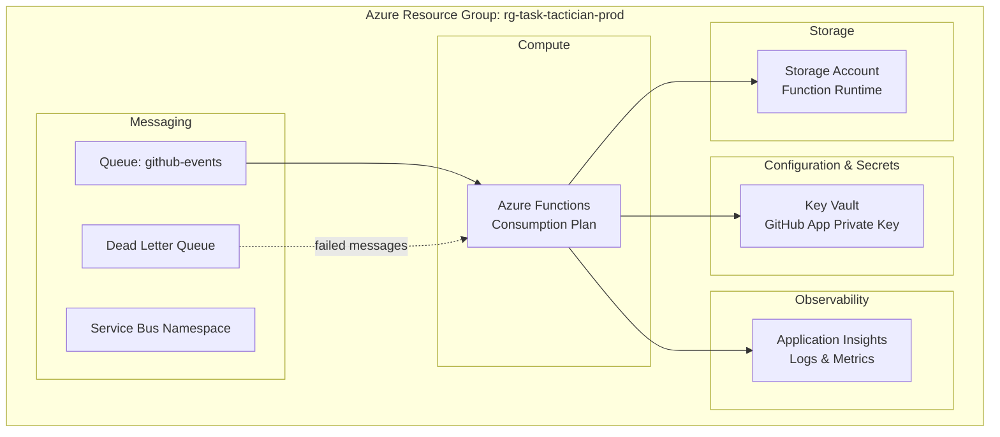

# Operations and Deployment

This document defines operational requirements, deployment architecture expectations, monitoring strategy, and scaling considerations for Task-Tactician.

## Deployment Architecture

**Note**: Task-Tactician deployment automation is managed from separate infrastructure repositories using Terraform or equivalent IaC tools. This document specifies deployment **requirements and expectations**, not implementation.

### Azure Deployment Model

### Resource Naming Convention

**Pattern**: `{resource-type-abbrev}-task-tactician-{environment}`

**Examples**:

- Function App: `func-task-tactician-prod`
- Service Bus: `sb-task-tactician-prod`
- Key Vault: `kv-task-tactician-prod`
- App Insights: `ai-task-tactician-prod`
- Storage Account: `sttasktacticianprod` (no hyphens for storage)

### Environment Strategy

**Environments**:

1. **Development** (`-dev`): Testing and experimentation
2. **Staging** (`-staging`): Pre-production validation
3. **Production** (`-prod`): Live service

**Differences**:

| Aspect | Development | Staging | Production |
|--------|-------------|---------|------------|
| Function Plan | Consumption | Consumption | Premium (if needed) |
| Service Bus Tier | Basic | Standard | Standard |
| Key Vault SKU | Standard | Standard | Premium |
| Geo-Redundancy | No | No | Yes |
| Monitoring | Basic | Full | Full + Alerts |

## Infrastructure as Code

### Deployment Requirements

**Deployment Approach**: Infrastructure provisioning managed from separate infrastructure repositories, not from Task-Tactician application repository.

**Recommended Tool**: Terraform or equivalent declarative IaC tool

**Expected Characteristics**:

- Infrastructure defined in version-controlled templates in dedicated repository
- Automated deployment via CI/CD pipeline
- Parameterized for multi-environment support (dev, staging, prod)
- Idempotent: can rerun without side effects
- State management for tracking resource changes

**Required Resources**:

- Azure Function App with Rust custom runtime support
- Service Bus namespace, queue, and session-based delivery
- Key Vault with access policies for managed identity
- Application Insights workspace for telemetry
- Storage account for function runtime state
- Managed identity for service authentication (no credentials)

**Deployment Repository Responsibilities**:

- Define all Azure resources with proper configuration
- Manage secrets securely (never in source control)
- Configure networking and security policies
- Set up monitoring and alerting rules
- Handle environment promotion workflow
- Document deployment procedures and runbooks

### Configuration Management

**Application Settings** (Function App):

- `ServiceBus__ConnectionString`: Connection to Service Bus (from Key Vault reference)
- `ServiceBus__QueueName`: "github-events"
- `GitHub__AppId`: GitHub App identifier
- `GitHub__InstallationId`: Installation identifier (per environment)
- `KeyVault__VaultUrl`: URL to Key Vault
- `ApplicationInsights__ConnectionString`: Application Insights connection

**Secrets** (Key Vault):

- `GitHubAppPrivateKey`: PEM-formatted private key
- `ServiceBusConnectionString`: Connection string for Service Bus

## Monitoring and Observability

### Logging Strategy

**Log Levels**:

- **Debug**: Verbose details for troubleshooting (disabled in production)
- **Info**: Normal operations (event processed, branch created)
- **Warn**: Recoverable issues (configuration missing, fallback used)
- **Error**: Failures requiring attention (API errors, processing failures)

**Log Format**: Structured JSON

**Required Fields**:

- `timestamp`: ISO 8601 format
- `level`: Log level
- `message`: Human-readable description
- `correlation_id`: Request tracking identifier
- `repository`: Repository identifier
- `event_type`: GitHub event type
- `operation`: Operation being performed

### Metrics and Alerts

**Key Metrics**:

| Metric | Description | Alert Threshold |
|--------|-------------|-----------------|
| `events_processed_total` | Count of events processed | N/A (monitoring only) |
| `events_failed_total` | Count of failed events | >5% error rate over 5 min |
| `event_processing_duration_seconds` | Processing latency | P95 >10 seconds |
| `github_api_calls_total` | GitHub API call count | N/A (rate limit tracking) |
| `github_api_rate_limit_remaining` | API quota remaining | <1000 (20% threshold) |
| `configuration_load_errors_total` | Config load failures | >10 failures in 10 min |
| `dead_letter_queue_depth` | Messages in DLQ | >10 messages |

**Alert Destinations**:

- Critical: PagerDuty (24/7 on-call)
- Warning: Slack #alerts channel
- Info: Email to operations team

### Dashboards

**Operational Dashboard**:

- Event processing throughput (events/minute)
- Error rate by error type (transient, configuration, business logic)
- GitHub API quota consumption
- Queue depth (main queue + dead letter queue)
- Processing latency percentiles (P50, P95, P99)

**Business Dashboard**:

- Branches created per repository
- PR-issue linking success rate
- Most active repositories (event volume)
- Configuration usage by feature (branch creation, label application)

### Tracing and Correlation

**Correlation ID Flow**:

1. Event arrives with correlation ID (from Queue-Keeper) or generate new UUID
2. All log entries include correlation ID
3. All GitHub API calls include correlation ID in custom header
4. Enables end-to-end tracing of single event through system

**Distributed Tracing**: Application Insights automatic instrumentation for request tracking

## Scaling and Performance

### Horizontal Scaling

**Function App Scaling**:

- **Trigger**: Service Bus queue depth
- **Scaling Rule**: Add instance for every 100 messages in queue
- **Maximum Instances**: 100 (configurable)
- **Scale-In**: Remove instances when queue depth decreases

**Concurrency**: Each function instance processes one message at a time (configurable)

### Performance Optimization

**Strategies**:

1. **Configuration Caching**: 5-minute TTL reduces GitHub API calls
2. **Installation Token Caching**: 1-hour TTL reduces token requests
3. **Batch Operations**: Group label changes when possible
4. **Lazy Loading**: Fetch data only when needed

**Bottlenecks**:

- **GitHub API Rate Limit**: 5000 req/hour per installation (primary constraint)
- **Service Bus Throughput**: Standard tier supports high message volume
- **Function Cold Starts**: Premium plan reduces cold start latency if needed

### Rate Limit Management

**GitHub API Quota**:

- **Primary Limit**: 5000 requests/hour per installation
- **Tracking**: Parse rate limit headers from each API response
- **Circuit Breaker**: Open at 20% remaining (1000 requests)
- **Recovery**: Reset quota after 1-hour window

**Mitigation**:

- Cache configuration to reduce file content API calls
- Batch label operations when possible
- Prioritize critical operations (branch creation) over non-critical (comments)

## Deployment Process

### CI/CD Pipeline

**Stages**:

1. **Build**: Compile Rust code, run unit tests
2. **Package**: Create deployment artifact (container image or zip)
3. **Deploy to Staging**: Automated deployment on merge to main
4. **Integration Tests**: Run tests against staging environment
5. **Deploy to Production**: Manual approval gate
6. **Smoke Tests**: Verify production health post-deployment

**Rollback Strategy**:

- Maintain previous deployment package
- One-click rollback via Azure portal or CLI
- Automatic rollback on failed health checks

### Release Process

**Versioning**: Semantic versioning (MAJOR.MINOR.PATCH)

**Release Cadence**: Bi-weekly releases (every other Friday)

**Release Checklist**:

- [ ] All tests passing
- [ ] Performance benchmarks met
- [ ] Security scans clean
- [ ] Release notes prepared
- [ ] Staging deployment validated
- [ ] Production deployment approved
- [ ] Post-deployment smoke tests pass
- [ ] Monitoring confirms normal operation

## Disaster Recovery

### Failure Scenarios

**Scenario 1: Azure Function Outage**

- **Detection**: Health check failures, alerts triggered
- **Impact**: Events queue up in Service Bus (buffer)
- **Recovery**: Azure auto-restarts function; events process when recovered
- **RTO**: <15 minutes (automatic recovery)
- **RPO**: 0 (no data loss, events retained in queue)

**Scenario 2: GitHub API Outage**

- **Detection**: High error rate from GitHub API calls
- **Impact**: Event processing fails, messages requeued
- **Recovery**: Circuit breaker opens, waits for GitHub recovery
- **RTO**: Depends on GitHub recovery time
- **RPO**: 0 (events retry when GitHub recovers)

**Scenario 3: Service Bus Outage**

- **Detection**: Unable to receive messages from queue
- **Impact**: New events not processed until recovery
- **Recovery**: Azure Service Bus SLA guarantees recovery
- **RTO**: <1 hour (Azure SLA)
- **RPO**: 0 (Queue-Keeper retains events)

**Scenario 4: Key Vault Unavailable**

- **Detection**: Unable to retrieve GitHub App private key
- **Impact**: Cannot authenticate to GitHub API
- **Recovery**: Cached tokens continue working (up to 1 hour); service recovers when Key Vault available
- **RTO**: <30 minutes
- **RPO**: 0

### Backup and Recovery

**No Persistent State**: Task-Tactician is stateless; no backups required

**Configuration Backup**: Configuration stored in GitHub repositories (version controlled)

**Secrets Rotation**:

- GitHub App private key rotated every 90 days (manual process)
- Service Bus connection strings rotated on compromise (immediate)

## Security Operations

### Access Control

**Azure RBAC**:

- Function App managed identity: Contributor on resource group
- DevOps service principal: Contributor for deployment
- Operations team: Reader for monitoring
- Security team: Security Administrator for audit

**GitHub App Permissions**:

- Issues: Read/write
- Pull requests: Read/write
- Contents: Read (for configuration files)
- Metadata: Read

**Least Privilege**: Minimal permissions for each operation

### Security Monitoring

**Alerts**:

- Unusual API call patterns (potential abuse)
- Failed authentication attempts
- Unexpected secret access patterns
- Configuration changes in production

**Audit Logging**:

- All GitHub API calls logged
- Configuration loads logged
- Secret retrievals logged
- Deployment activities logged

### Compliance

**Data Residency**: All Azure resources in single region (e.g., East US)

**Data Retention**: Logs retained 90 days, metrics retained 1 year

**Encryption**:

- At-rest: Azure Storage and Key Vault encrypted by default
- In-transit: TLS 1.2+ for all external communication

## Cost Management

### Cost Drivers

| Resource | Pricing Model | Estimated Monthly Cost |
|----------|---------------|------------------------|
| Azure Functions (Consumption) | Per execution + duration | $10-50 (varies with event volume) |
| Service Bus (Standard) | Base + message operations | $10-20 |
| Key Vault (Standard) | Per operation | $1-5 |
| Application Insights | Per GB ingested | $5-20 |
| Storage Account | Per GB + transactions | $1-5 |

**Total Estimated**: $30-100/month (depends on event volume)

### Cost Optimization

**Strategies**:

- Use Consumption plan for Functions (pay-per-use)
- Cache configuration and tokens to reduce API calls
- Optimize log volume (appropriate log levels)
- Monitor and right-size resources

## Operational Runbooks

### Common Operations

**1. Deploy New Version**:

- Merge changes to main branch
- CI/CD pipeline builds and deploys to staging
- Run integration tests on staging
- Approve production deployment
- Monitor health metrics post-deployment

**2. Investigate Failed Event**:

- Search logs by correlation ID
- Check event payload in dead letter queue
- Identify error type (transient, configuration, business logic)
- Resolve root cause (fix code, update configuration, manual intervention)
- Replay event if needed

**3. Handle Rate Limit Exhaustion**:

- Check current rate limit consumption in metrics
- Identify high-volume operations in logs
- Optimize operations or increase quota (if possible)
- Consider implementing operation queuing/prioritization

**4. Rotate GitHub App Key**:

- Generate new private key in GitHub App settings
- Update Key Vault secret with new key
- Monitor for authentication errors
- Revoke old key after verification

### Troubleshooting Guide

**Symptom**: Events not processing

- Check Function App health (running, no errors)
- Check Service Bus queue depth (messages waiting?)
- Check GitHub API rate limit (exhausted?)
- Check logs for errors (authentication, configuration, API)

**Symptom**: High error rate

- Identify error type from metrics (which error category?)
- Check GitHub API status (outage?)
- Review recent configuration changes (invalid config?)
- Check logs for error patterns

**Symptom**: Slow processing

- Check latency metrics (where is bottleneck?)
- Check GitHub API response times (slow API?)
- Check configuration cache hit rate (excessive fetches?)
- Check queue depth (backlog growing?)

## Operational Principles

1. **Automate Everything**: Infrastructure, deployments, monitoring
2. **Fail Gracefully**: Circuit breakers, retries, dead letter queues
3. **Observe Deeply**: Structured logs, metrics, tracing
4. **Alert Actionably**: Alerts include context and resolution steps
5. **Recover Quickly**: Automated recovery, clear runbooks
6. **Cost Consciously**: Monitor costs, optimize resource usage
7. **Secure by Default**: Least privilege, encryption, audit logging
