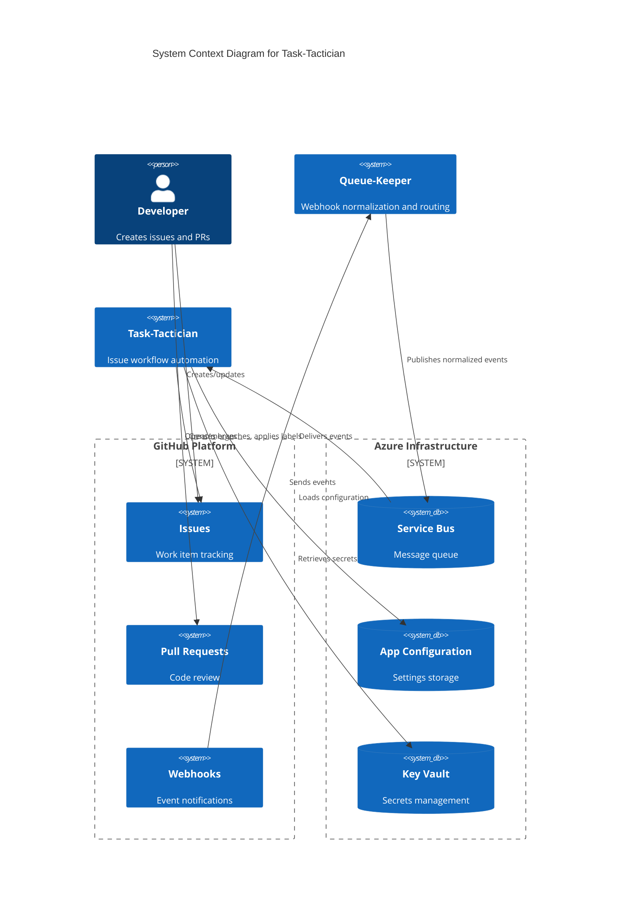

# System Overview

## Purpose and Scope

Task-Tactician is a GitHub automation bot that streamlines issue workflow management and branch creation for OffAxis Dynamics development teams. The system automates repetitive tasks in the issue lifecycle, reducing manual overhead and ensuring consistency across repositories.

### What Task-Tactician Does

- **Automated Branch Creation**: Creates feature branches when issues move to "in progress" state
- **Workflow Label Management**: Applies and updates labels tracking issue lifecycle (in-progress, blocked, has-pr)
- **PR-Issue Workflow Labels**: Monitors PR events and applies "has-pr" label to issues when GitHub's native linking detects relationships
- **Label Discovery**: Adapts to repository's existing labels rather than requiring specific label names
- **State Tracking**: Monitors issue lifecycle from creation through completion
- **Milestone Prompting**: Suggests milestone assignment on new issues (advisory)
- **Dependency Tracking**: Parses issue descriptions for dependency relationships
- **Cycle Time Analytics**: Records metrics for velocity tracking
- **Stale Issue Detection**: Flags inactive issues for triage
- **Multi-Repository Support**: Operates consistently across all repositories in an organization

### What Task-Tactician Does NOT Do

- **Does NOT handle PR review/approval/merge workflows** (separate bot responsibility)
- **Does NOT create PR-issue links** (relies on GitHub's native linking via "closes #123" keywords in PR descriptions)
- **Does NOT create or manage labels** (discovers and uses existing repository labels)
- **Does NOT persist state** (GitHub is source of truth)
- **Does NOT auto-close issues** (only flags and tracks state)
- **Does NOT replace project management tools** (augments GitHub native features)
- **Does NOT deploy from application repository** (infrastructure managed separately with Terraform)

## System Context

## Glossary

### Domain Terms

| Term | Definition |
|------|------------|
| **Workflow Event** | Normalized GitHub event (issue/PR action) requiring processing |
| **Issue Lifecycle** | Progression through states: Open → InProgress → HasPR → Done |
| **InProgress State** | Issue actively being worked on (has in-progress label or in "In Progress" column) |
| **Branch Naming Convention** | Pattern: `{prefix}/{issue-number}-{slug}` where prefix based on issue type |
| **PR-Issue Linking** | GitHub's native association between pull request and issue (via keywords like "closes #123") |
| **Configuration Hierarchy** | Precedence order: Repository > Organization > System Default |
| **Idempotent Operation** | Operation producing same result regardless of execution count |
| **Workflow Action** | Discrete operation: CreateBranch, ApplyLabel, RemoveLabel, etc. |

### Technical Terms

| Term | Definition |
|------|------------|
| **Message Queue** | Azure Service Bus or AWS SQS for event delivery |
| **Queue Session** | Ordered message delivery mechanism keyed by repository |
| **Deduplication Window** | Time period (10 min) for tracking processed message IDs |
| **Dead Letter Queue** | Storage for messages that fail after max retries |
| **GitHub App** | OAuth application type for API authentication |
| **Installation Token** | Short-lived access token scoped to organization/repository |
| **Rate Limit** | GitHub API quota (5000 requests/hour per installation) |
| **Circuit Breaker** | Pattern to prevent cascading failures during outages |
| **Correlation ID** | UUID tracking single request through system |
| **Result Type** | Type representing success (Ok) or failure (Err) with error details |

## Key Constraints

### Business Constraints

1. **GitHub as Source of Truth**: No persistent state storage; all data retrieved from GitHub
2. **Existing Labels Only**: Must use repository's existing labels; cannot create new labels
3. **Issue-Focused Automation**: PR workflows handled by separate bot
4. **Assignment vs. Progress**: Issue assignment does not trigger workflow (used for triage); InProgress state triggers automation
5. **Multi-Tenant**: Support multiple organizations and repositories with independent configurations

### Technical Constraints

1. **Event-Driven Architecture**: All operations triggered by events (no polling/scheduled jobs)
2. **Stateless Service**: No database or persistent storage
3. **Idempotent Operations**: All operations safe to retry
4. **At-Least-Once Delivery**: Message queue guarantees at-least-once delivery; system must handle duplicates
5. **Ordered Processing**: Events for same repository must process in sequence
6. **Rate Limit Compliance**: Must respect GitHub API rate limits (5000 req/hour)
7. **Cloud Platform**: Azure-first with abstraction for future AWS support

### Performance Constraints

1. **Event Processing Latency**: <5 seconds P95 from receipt to completion
2. **GitHub API Latency**: <2 seconds P95 per API call
3. **Configuration Cache TTL**: 5 minutes
4. **Deduplication Window**: 10 minutes
5. **Message Lock Timeout**: 5 minutes (with renewal for long operations)
6. **Concurrent Processing**: Multiple events processed simultaneously (different repositories)

### Security Constraints

1. **No Secrets in Code**: All secrets stored in Azure Key Vault
2. **Managed Identity**: Service authenticates to Azure resources via managed identity
3. **GitHub App Authentication**: All GitHub API calls use installation tokens (1-hour lifespan)
4. **Least Privilege**: GitHub App permissions limited to required operations (issues, PRs, contents)
5. **Audit Trail**: All operations logged with correlation ID for tracing

## Integration Points

### Upstream: Queue-Keeper

**Relationship**: Task-Tactician consumes events from Queue-Keeper

**Contract**:

- **Queue**: Azure Service Bus queue "github-events"
- **Message Format**: JSON with GitHub webhook payload + metadata envelope
- **Session Key**: Repository full name (e.g., "owner/repo")
- **Properties**: MessageId, CorrelationId, EventType, Action

**Delivery Guarantee**: At-least-once with sessions for ordering

**Failure Handling**: Dead letter queue for failed messages

### Downstream: GitHub API

**Relationship**: Task-Tactician executes operations via GitHub API

**Authentication**: GitHub App with installation tokens

**API Version**: REST API v3

**Operations Used**:

- Branches: GET (check existence), POST (create)
- Issues: GET (fetch data), PATCH (update), POST comments, PUT/DELETE labels
- Pull Requests: GET (fetch data)
- Contents: GET (retrieve configuration files)

**Rate Limits**: 5000 requests/hour per installation

**Error Handling**: Retry transient errors (5xx, 429), fail fast on client errors (4xx)

### Configuration: GitHub Repository Files

**Relationship**: Task-Tactician retrieves configuration from GitHub repositories

**File Location**: `.github/task-tactician.yml` (repository-level)

**Fallback**: Organization-level config → System defaults

**Cache Strategy**: 5-minute TTL, invalidate on configuration change event

### Secrets: Azure Key Vault

**Relationship**: Task-Tactician retrieves GitHub App private key

**Authentication**: Managed identity

**Secrets Stored**:

- `GitHubAppPrivateKey`: PEM-formatted private key for JWT signing

**Cache Strategy**: In-memory cache with 1-hour TTL

### Observability: Application Insights

**Relationship**: Task-Tactician sends logs and metrics

**Log Format**: Structured JSON with correlation ID

**Metrics**: Events processed, errors, API calls, workflow actions

**Traces**: End-to-end tracing with correlation ID

## Deployment Model

### Azure Functions

**Runtime**: Custom runtime supporting Rust

**Hosting Plan**: Consumption (serverless) for cost efficiency

**Scaling**: Automatic based on Service Bus queue depth

**Trigger**: Service Bus queue message

**Execution Model**: One function instance per message (concurrent processing)

### Resource Dependencies

- **Azure Service Bus**: Message queue and dead letter queue
- **Azure App Configuration**: Centralized configuration (optional, using GitHub files)
- **Azure Key Vault**: Secret storage (GitHub App private key)
- **Application Insights**: Logging and monitoring
- **Azure Storage**: Function App runtime requirements

### Future: AWS Lambda Support

**Abstraction Layer**: Infrastructure interfaces enable multi-cloud

**AWS Equivalents**:

- Service Bus → SQS/SNS
- App Configuration → Parameter Store
- Key Vault → Secrets Manager
- Application Insights → CloudWatch

## Operational Requirements

### Availability

- **Target**: 99.9% availability (allows ~43 minutes downtime/month)
- **Dependencies**: GitHub API availability, Azure Service Bus availability
- **Failure Mode**: Graceful degradation; queue buffers events during outages

### Scalability

- **Throughput**: Process 100+ events/second under load
- **Concurrency**: Unlimited concurrent processing (different repositories)
- **Ordering**: Sequential processing per repository (session-based)
- **Bottleneck**: GitHub API rate limit (5000 req/hour = ~1.4 req/sec)

### Monitoring

- **Health Checks**: Function App availability, queue depth, API rate limit consumption
- **Alerts**: Error rate >5%, rate limit >80%, queue depth >100, processing latency >10s
- **Dashboards**: Event throughput, error rates, API usage, workflow action counts
- **Logs**: Structured JSON with correlation ID, searchable in Application Insights

### Disaster Recovery

- **RTO** (Recovery Time Objective): <1 hour
- **RPO** (Recovery Point Objective): 0 (no data loss; events in queue retained)
- **Backup**: No persistent state to backup; configuration in GitHub repositories
- **Failover**: Azure Functions auto-recovery; message queue retains unprocessed events

## Success Metrics

### Functional Metrics

1. **Branch Creation Success Rate**: >95% of eligible issues get branches created
2. **Event Processing Success Rate**: >99% of events processed successfully
3. **Workflow Label Accuracy**: >95% of workflow state transitions result in correct label application
4. **Configuration Availability**: >99% configuration load success rate

### Performance Metrics

1. **Event Processing Latency**: P95 <5 seconds, P99 <10 seconds
2. **GitHub API Latency**: P95 <2 seconds per call
3. **Throughput**: Support 100 events/second peak load
4. **Configuration Cache Hit Rate**: >90%

### Reliability Metrics

1. **Idempotency**: 100% of duplicate events detected and skipped
2. **Error Recovery**: >95% of transient errors recover via retry
3. **Dead Letter Rate**: <1% of events end in dead letter queue
4. **Uptime**: >99.9% function availability

### Operational Metrics

1. **Mean Time to Detect (MTTD)**: <5 minutes for critical issues
2. **Mean Time to Recover (MTTR)**: <30 minutes for service outages
3. **False Positive Alert Rate**: <10% of alerts
4. **Configuration Deployment Time**: <5 minutes for configuration changes

## Open Questions and Assumptions

### Assumptions

1. **Queue-Keeper Reliability**: Assumes Queue-Keeper delivers events reliably with correct session keys
2. **GitHub API Availability**: Assumes GitHub API >99% availability
3. **Label Existence**: Assumes repositories have necessary workflow labels configured
4. **Event Volume**: Assumes <10,000 events/day per repository (manageable within rate limits)
5. **Repository Access**: Assumes GitHub App installed with appropriate permissions

### Open Questions

1. **Stale Issue Management**: Should system flag inactive issues? (Spec says yes, non-blocking)
2. **Milestone Auto-Assignment**: Should system auto-assign to "current" milestone? (Currently prompts user)
3. **Multi-Branch Support**: How to handle multiple branches for same issue?
4. **Branch Cleanup**: Should system delete branches after PR merge?
5. **Analytics**: Should system track cycle time metrics? (Spec says yes, but scope TBD)

## Related Systems

| System | Relationship | Responsibility |
|--------|-------------|----------------|
| Queue-Keeper | Upstream | Webhook normalization and event routing |
| GitHub | Downstream | Source of truth for issues, PRs, branches |
| PR Workflow Bot | Sibling | Handles PR-specific workflows (review, merge) |
| CI/CD Pipeline | Sibling | Builds and tests on branch creation |
| Project Management | Sibling | Sprint planning, milestone management |
