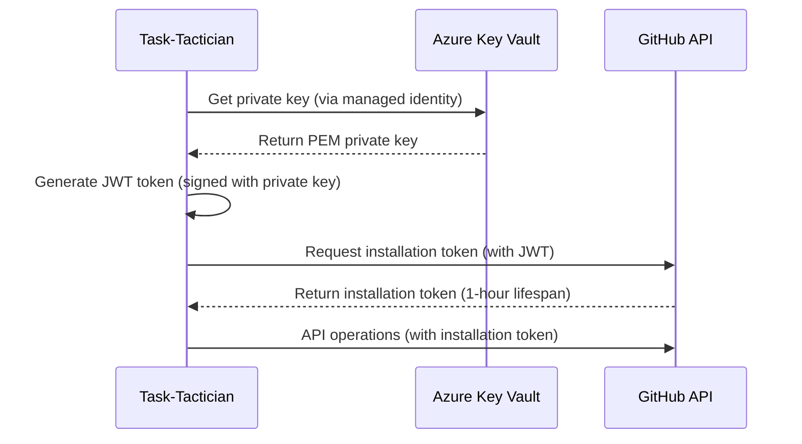

# Security Architecture

This document defines the security model, threat analysis, and mitigation strategies for Task-Tactician.

## Security Principles

1. **Least Privilege**: Minimal permissions for all operations
2. **Defense in Depth**: Multiple layers of security controls
3. **Zero Trust**: Verify every request, never assume trust
4. **Secure by Default**: Secure configuration out of the box
5. **Audit Everything**: Comprehensive logging for security events
6. **Fail Securely**: Security failures should fail closed, not open

## Authentication and Authorization

### GitHub App Authentication

**Authentication Flow**:

**Security Controls**:

- **Private Key Storage**: Stored in Azure Key Vault, never in code/config
- **Key Access**: Retrieved via managed identity (no credentials in code)
- **Token Lifespan**: Installation tokens expire after 1 hour (automatic renewal)
- **Token Scope**: Limited to specific installation (organization/repository)
- **Token Storage**: Cached in memory only, never persisted to disk

### Azure Resource Authentication

**Managed Identity**:

- Function App assigned system-managed identity
- Identity granted minimal permissions via Azure RBAC
- No credentials stored or managed manually

**Permissions Granted**:

- Key Vault: Get secrets (private key retrieval)
- Service Bus: Receive messages, send to dead letter queue
- Application Insights: Write logs and metrics
- Storage Account: Read/write for function runtime

## Secrets Management

### Secret Storage

**Azure Key Vault**:

- All secrets stored in Key Vault
- Access controlled via Azure RBAC
- Secrets versioned (supports rotation)
- Access logged for audit

**Secrets Stored**:

- `GitHubAppPrivateKey`: GitHub App private key (PEM format)
- `ServiceBusConnectionString`: Service Bus connection string (if not using managed identity)

### Secret Rotation

**GitHub App Private Key**:

- **Frequency**: Every 90 days (manual process)
- **Process**:
  1. Generate new key pair in GitHub App settings
  2. Upload new private key to Key Vault as new version
  3. Update function app configuration to use new version
  4. Verify authentication working with new key
  5. Revoke old key in GitHub App settings

**Service Bus Connection String**:

- **Frequency**: On compromise or annually
- **Process**: Regenerate connection string, update Key Vault, restart function

### Secret Access Auditing

**Audit Log Capture**:

- All Key Vault access logged to Azure Monitor
- Logs include: timestamp, identity, secret name, operation (read/write)
- Alerts on unexpected access patterns

## Threat Model

### Threat: Compromised GitHub App Private Key

**Impact**: Attacker can authenticate as Task-Tactician, perform unauthorized GitHub operations

**Likelihood**: Low (key stored in secure vault)

**Mitigations**:

- Store key in Azure Key Vault with access controls
- Access via managed identity only
- Monitor and alert on unusual authentication patterns
- Rotate key every 90 days
- Revoke key immediately if compromise suspected

**Detection**:

- Unusual API call patterns (geographic, volume, timing)
- Failed authentication attempts
- Unexpected Key Vault access

### Threat: GitHub API Abuse

**Impact**: Excessive API calls exhaust rate limit, disrupt service

**Likelihood**: Medium (if vulnerable to malicious events)

**Mitigations**:

- Input validation on all event payloads
- Rate limit tracking with circuit breaker
- Event deduplication prevents replay attacks
- GitHub App permissions limited to minimum required

**Detection**:

- Rate limit consumption metrics
- Unusually high event volume
- Repeated failed API calls

### Threat: Malicious Event Injection

**Impact**: Attacker injects crafted events to trigger unintended actions

**Likelihood**: Low (events come from trusted Queue-Keeper)

**Mitigations**:

- Events originate from Queue-Keeper (trusted source)
- Event payload validation before processing
- GitHub webhooks secured with secret (Queue-Keeper responsibility)
- Business logic validates all operations before execution

**Detection**:

- Invalid event payload validation failures
- Unexpected event patterns (type, frequency, source)

### Threat: Information Disclosure

**Impact**: Sensitive data (repository contents, issue details) leaked via logs or errors

**Likelihood**: Low (proper logging hygiene)

**Mitigations**:

- Structured logging with controlled fields
- No sensitive data in log messages
- Log levels enforced (debug disabled in production)
- Access to logs controlled via Azure RBAC

**Detection**:

- Regular log reviews for sensitive data patterns
- Automated scanning for secrets in logs

### Threat: Privilege Escalation

**Impact**: Attacker gains elevated permissions in GitHub or Azure

**Likelihood**: Very Low (multiple controls)

**Mitigations**:

- GitHub App permissions limited to required operations only
- No write access to repository code (only issues/PRs/branches)
- Azure managed identity with minimal RBAC permissions
- No direct user access to Function App runtime

**Detection**:

- Unusual Azure AD sign-ins
- Permission changes in GitHub App
- RBAC changes in Azure subscription

### Threat: Denial of Service

**Impact**: System overwhelmed, unable to process legitimate events

**Likelihood**: Medium (public GitHub events)

**Mitigations**:

- Function App auto-scaling handles load spikes
- Service Bus queue buffers events during high volume
- Circuit breaker prevents resource exhaustion
- Dead letter queue isolates failed events

**Detection**:

- Queue depth metrics
- Processing latency metrics
- Error rate spikes

## Data Protection

### Data Classification

**Public Data** (no protection required):

- Repository names, issue titles, PR descriptions
- GitHub usernames
- Workflow configuration

**Confidential Data** (protection required):

- GitHub App private key
- Installation tokens
- Service Bus connection strings

**No Personal Data**: Task-Tactician does not process personal/sensitive data beyond GitHub usernames (public information)

### Data in Transit

**Encryption**:

- All external communication uses TLS 1.2+
- GitHub API calls over HTTPS
- Service Bus communication encrypted
- Key Vault access encrypted

**Certificate Management**: Azure-managed certificates (automatic renewal)

### Data at Rest

**Encryption**:

- Azure Key Vault: Customer-managed encryption
- Service Bus: Microsoft-managed encryption
- Application Insights: Microsoft-managed encryption
- No persistent data storage (stateless architecture)

### Data Retention

**Logs**: Retained 90 days in Application Insights

**Metrics**: Retained 1 year

**Events**: Not persisted (processed and discarded)

**Secrets**: Retained indefinitely in Key Vault (manual deletion required)

## Network Security

### Inbound Traffic

**No Inbound Network Access Required**:

- Function triggered by Service Bus queue (internal Azure communication)
- No public HTTP endpoints
- No VPN or firewall rules needed

### Outbound Traffic

**Required Destinations**:

- GitHub API: `api.github.com` (port 443)
- Service Bus: `*.servicebus.windows.net` (ports 443, 5671)
- Key Vault: `*.vault.azure.net` (port 443)
- Application Insights: `*.applicationinsights.azure.com` (port 443)

**Firewall Rules**: None required (all Azure-managed destinations)

**Future Enhancement**: Private endpoints for Azure services (enhanced security)

## Compliance and Auditing

### Audit Logging

**Logged Events**:

- All GitHub API operations (create branch, apply label, add comment)
- Configuration loads from GitHub
- Secret retrievals from Key Vault
- Event processing (success/failure)
- Error conditions and retries

**Log Format**: Structured JSON with correlation ID

**Log Retention**: 90 days

**Log Access**: Controlled via Azure RBAC (read-only for operations team)

### Security Monitoring

**Metrics**:

- Failed authentication attempts
- GitHub API errors (403 Forbidden, 401 Unauthorized)
- Key Vault access patterns
- Unusual event volumes

**Alerts**:

- Multiple failed authentications within 5 minutes
- GitHub API 403 errors (permission issues)
- Unexpected Key Vault access (outside maintenance windows)

### Compliance Requirements

**GDPR**: Not applicable (no EU user personal data processing)

**SOC 2**: Logging and monitoring support SOC 2 controls

**ISO 27001**: Security controls align with ISO 27001 framework

## Incident Response

### Security Incident Classification

**Critical**:

- GitHub App private key compromised
- Unauthorized GitHub operations detected
- Azure subscription compromised

**High**:

- Unusual API call patterns indicating abuse
- Failed authentication attempts exceeding threshold
- Unexpected configuration changes

**Medium**:

- Single failed authentication attempt
- GitHub API rate limit exhausted
- Key Vault access outside normal patterns

**Low**:

- Event processing errors (non-security)
- Configuration load failures

### Incident Response Playbook

**Step 1: Detection**

- Alert triggered or manual discovery
- Verify incident severity
- Notify security team and on-call engineer

**Step 2: Containment**

- **If private key compromised**: Revoke GitHub App key immediately
- **If abnormal API activity**: Suspend GitHub App (if possible)
- **If Azure compromise**: Disable managed identity, revoke access

**Step 3: Investigation**

- Review audit logs (GitHub, Azure, Application Insights)
- Identify scope of compromise (which operations, which data)
- Determine root cause

**Step 4: Remediation**

- Rotate compromised secrets
- Update access controls
- Deploy fixes if vulnerabilities found
- Restore normal operations

**Step 5: Post-Incident Review**

- Document incident timeline
- Identify improvements to prevent recurrence
- Update runbooks and detection rules

## Security Testing

### Threat Modeling

**Frequency**: Annual review or when architecture changes

**Process**: STRIDE methodology

**Outcomes**: Documented threats and mitigations

### Vulnerability Scanning

**Dependency Scanning**:

- Automated scanning of Rust dependencies (cargo audit)
- CI pipeline blocks merges with high-severity vulnerabilities
- Weekly dependency update reviews

**Container Scanning**:

- Scan function app container images for vulnerabilities
- Address critical and high-severity findings before deployment

### Penetration Testing

**Frequency**: Annually or before major releases

**Scope**: GitHub App authentication flow, event processing logic

**Outcomes**: Findings documented, remediation tracked

## Security Best Practices

### Secure Coding

- No hardcoded secrets in code or configuration
- Input validation on all external data (event payloads)
- Output encoding for log messages (prevent injection)
- Error messages do not leak sensitive information
- Dependencies kept up to date

### Operational Security

- Secrets rotated regularly (90-day cycle for GitHub App key)
- Access to production limited to authorized personnel
- All production changes reviewed and approved
- Deployment process automated (reduces human error)

### Monitoring and Alerting

- Security metrics tracked (failed auth, permission errors)
- Alerts configured for suspicious activity
- Logs reviewed regularly for anomalies
- Incident response procedures documented and tested

## Security Assumptions

1. **Queue-Keeper Trustworthy**: Events from Queue-Keeper are authentic and validated
2. **Azure Platform Secure**: Azure infrastructure and services meet security requirements
3. **GitHub Platform Secure**: GitHub API and webhook delivery mechanism secure
4. **Personnel Vetted**: Operations and development teams undergo background checks
5. **Network Secure**: Azure internal network communication secure

## Future Security Enhancements

1. **Private Endpoints**: Use Azure Private Link for Service Bus and Key Vault
2. **Customer-Managed Keys**: Use customer-managed encryption keys for enhanced control
3. **Anomaly Detection**: Machine learning-based detection of unusual patterns
4. **Automated Key Rotation**: Fully automated GitHub App key rotation
5. **Security Hardening**: Function App network isolation, IP whitelisting
