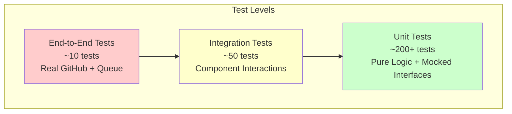

# Testing Strategy

This document defines the testing approach for Task-Tactician, focusing on test strategy, coverage requirements, and behavioral validation rather than specific implementation details.

## Testing Philosophy

Task-Tactician's testing strategy ensures:

1. **Business Logic Correctness**: Workflow rules behave as specified
2. **Integration Reliability**: Components interact correctly across boundaries
3. **Idempotency Guarantees**: Operations safe to retry without side effects
4. **Error Resilience**: Graceful handling of failures at all layers
5. **Performance Compliance**: Meets latency and throughput requirements

## Test Pyramid



**Distribution Principle**: Majority of tests at unit level for fast feedback; selective integration and E2E tests for high-value scenarios.

## Unit Testing Strategy

### Pure Function Testing

**Target**: Business logic with no external dependencies

**Examples**:

- Branch name generation (title → slug transformation)
- Issue state resolution (labels → workflow state)
- Configuration merging (hierarchy precedence rules)
- Error classification (status code → error type)

**Approach**:

- Test all edge cases (empty strings, special characters, boundary lengths)
- Property-based testing for invariants (branch names always valid format)
- No mocks required (pure functions)
- Fast execution (<1ms per test)

**Coverage Target**: 100% for pure functions

### Component Testing with Mocked Interfaces

**Target**: Business logic components using external system interfaces

**Examples**:

- Workflow Engine (mocked IGitHubOperations, IConfigurationStore)
- Configuration Manager (mocked IGitHubOperations for file retrieval)
- Event Processor (mocked IMessageQueue, IWorkflowEngine)

**Approach**:

- Mock all interface dependencies
- Test success paths and error scenarios
- Verify interface calls (arguments, call count, sequence)
- Assert state changes and return values

**Coverage Target**: >90% for workflow logic

### Test Scenarios by Component

#### Workflow Engine Tests

- Issue assignment does not trigger branch creation (assignment alone)
- Issue labeled "in-progress" triggers branch creation
- Branch creation skipped if branch already exists
- PR opening applies "has-pr" label to linked issues
- Configuration controls workflow enablement
- Error handling for GitHub API failures

#### Configuration Manager Tests

- Repository config overrides organization config
- Organization config overrides system defaults
- Cache returns stored config within TTL
- Cache refresh after TTL expiration
- Invalid YAML falls back to defaults
- Missing config file uses defaults

#### Branch Name Generator Tests

- Standard title produces correct slug
- Special characters replaced with hyphens
- Long titles truncated to max length
- Slug does not end with hyphen
- Issue number included in branch name
- Label determines prefix (bug → fix/, feature → feat/)

### Property-Based Testing

**Tool**: QuickCheck or similar property testing framework

**Invariants to Test**:

1. **Branch Name Validity**: Generated names always match pattern `^[a-z]+/\d+-[a-z0-9-]+$`
2. **Branch Name Length**: Never exceeds 65 characters
3. **Slug Format**: No leading/trailing hyphens, no consecutive hyphens
4. **Idempotency**: Same input produces same output regardless of execution count
5. **Configuration Merge**: Repository config always takes precedence over organization

**Example Properties**:

```
Property: branch_name_always_valid
For all issue_number: u32, title: String
  Where issue_number > 0 AND title.len() > 0
  Result: generate_branch_name(issue_number, title) matches valid pattern
```

## Integration Testing Strategy

### Component Interaction Testing

**Target**: Multiple components working together with real implementations (or test doubles)

**Examples**:

- Event Processor + Workflow Engine + Deduplication Cache
- Workflow Engine + Configuration Manager + GitHub Client (mocked HTTP)
- GitHub Client + Retry Policy + Rate Limiter

**Approach**:

- Use test doubles for external services (message queue, GitHub API)
- Test realistic event flows end-to-end within service boundary
- Verify data transformations across component boundaries
- Test error propagation and recovery

**Coverage Target**: Critical paths covered (not 100%)

### Integration Test Scenarios

#### Event Processing Flow

- Receive event → Deduplicate → Route → Process → Acknowledge
- Duplicate event detected and skipped
- Invalid event rejected and dead lettered
- Processing failure triggers retry logic

#### Configuration Loading Flow

- Repository config file retrieved from GitHub
- Organization config retrieved as fallback
- Hierarchy merged correctly
- Result cached for subsequent requests

#### GitHub API Interaction Flow

- Authentication: Generate JWT → Request installation token → Use token for API calls
- Branch creation: Check existence → Create if not exists
- Label application: Fetch current labels → Apply if not present
- Rate limit: Track quota → Open circuit when low

### Test Environment Setup

**Requirements**:

- Mock GitHub API server (WireMock or similar)
- Local/emulated message queue (Azure Service Bus emulator or in-memory queue)
- In-memory caches for configuration and deduplication
- Test configuration files with known values

**Isolation**: Each test runs in isolated environment (no shared state)

## End-to-End Testing Strategy

### Real GitHub Integration Testing

**Target**: Complete workflows against actual GitHub repositories

**Test Repository**: Dedicated test repository with known state

**Approach**:

- Create test issue with specific title and labels
- Trigger workflow (apply label, assign user)
- Wait for Task-Tactician to process event
- Verify expected outcomes (branch created, labels applied)
- Clean up test artifacts (branches, issues)

**Frequency**: Run on pull requests to main branch, not on every commit

### E2E Test Scenarios

#### Issue Assignment Workflow

1. Create issue "Test: Add authentication feature"
2. Assign issue to test user
3. Label issue with "feature" and "in-progress"
4. Verify branch "feat/{issue-number}-test-add-authentication-feature" created
5. Verify "in-progress" label present
6. Clean up: Delete branch, close issue

#### PR-Issue Linking Workflow

1. Create issue "Test: Fix login bug"
2. Create branch manually "fix/{issue-number}-test-fix-login-bug"
3. Create PR from branch
4. Verify "has-pr" label applied to issue
5. Clean up: Close PR, delete branch, close issue

### E2E Test Infrastructure

- **GitHub App**: Test installation with limited permissions
- **Test Repository**: Isolated repository for automation testing
- **Cleanup Strategy**: Delete all test artifacts after test completion
- **Rate Limit Management**: Throttle E2E tests to stay within quota

**Challenge**: E2E tests subject to GitHub API availability and rate limits; mark as flaky-tolerant

## Performance Testing Strategy

### Load Testing

**Objective**: Verify system handles expected event volume

**Approach**:

- Generate synthetic events matching production patterns
- Submit to message queue at varying rates
- Measure processing latency, throughput, error rate

**Scenarios**:

- Baseline: 10 events/second sustained
- Peak: 100 events/second for 1 minute
- Burst: 500 events/second for 10 seconds

**Acceptance Criteria**:

- P95 latency <5 seconds under baseline load
- P99 latency <10 seconds under peak load
- Error rate <1% under all scenarios
- No message queue backlog after load completes

### Stress Testing

**Objective**: Identify breaking points and failure modes

**Approach**:

- Continuously increase event rate until system degrades
- Monitor metrics: latency, error rate, queue depth
- Identify bottlenecks (GitHub API, message processing, configuration loading)

**Outcomes**:

- Document maximum sustainable throughput
- Identify resource constraints (CPU, memory, API quota)
- Validate graceful degradation (queueing, not crashing)

### Latency Testing

**Objective**: Measure end-to-end latency for event processing

**Metrics**:

- Event receipt to acknowledgment (total latency)
- Configuration loading time (cache hit vs. miss)
- GitHub API call latency
- Workflow processing time

**Acceptance Criteria**: P95 <5 seconds, P99 <10 seconds

## Test Coverage Requirements

### Business Logic Layer

- **Unit Tests**: >90% code coverage
- **Branch Coverage**: >85% (all conditional paths tested)
- **Mutation Testing**: >80% mutants killed (validates test quality)

### External System Interfaces

- **Contract Tests**: All interface methods have contract tests
- **Error Scenario Coverage**: All error types tested
- **Mock Implementations**: Test doubles available for all interfaces

### Infrastructure Layer

- **Integration Tests**: Critical paths covered (not 100%)
- **Error Handling**: Retry logic and circuit breaker tested
- **Authentication**: GitHub App authentication flow tested

## Behavioral Validation

All assertions in `assertions.md` must have corresponding automated tests:

- **Event Processing Assertions**: EP-1 through EP-4
- **Workflow Processing Assertions**: WF-1 through WF-7
- **Configuration Assertions**: CF-1 through CF-4
- **Error Handling Assertions**: EH-1 through EH-4
- **GitHub API Assertions**: GH-1 through GH-3
- **Observability Assertions**: OB-1 through OB-3
- **Performance Assertions**: PF-1 through PF-2
- **Security Assertions**: SE-1 through SE-2
- **Edge Case Assertions**: EC-1 through EC-3

## Test Data Management

### Fixture Data

**Requirements**:

- Realistic GitHub event payloads
- Representative issue and PR data
- Various configuration scenarios
- Edge cases (empty values, boundary conditions)

**Storage**: Test fixtures in `tests/fixtures/` directory

### Test Data Builders

**Pattern**: Fluent builder pattern for creating test data

**Examples**:

- IssueBuilder: Create issue with specific fields
- WorkflowEventBuilder: Create event with specific action
- RepositoryConfigBuilder: Create config with specific settings

**Benefits**: Readable tests, easy to create variations, avoid brittle test data

## Continuous Integration Testing

### CI Pipeline Requirements

**Stages**:

1. **Unit Tests**: Run on every commit (fast feedback)
2. **Integration Tests**: Run on pull requests
3. **E2E Tests**: Run on main branch merges
4. **Performance Tests**: Run nightly or on release branches

**Failure Handling**:

- Unit test failures block merge
- Integration test failures block merge
- E2E test failures warn but don't block (flaky tolerance)
- Performance test failures alert team

### Code Quality Gates

- **Test Coverage**: Minimum 90% for new code
- **Code Formatting**: Must pass formatter checks
- **Linting**: Must pass linter (clippy for Rust)
- **Security Scanning**: No high-severity vulnerabilities

## Test Maintenance Strategy

### Flaky Test Management

- **Detection**: Track test reliability (pass rate)
- **Quarantine**: Mark flaky tests, investigate root cause
- **Fix or Remove**: Fix within 1 week or remove from suite

### Test Refactoring

- **Regular Review**: Review test quality quarterly
- **DRY Principle**: Extract common setup to helpers
- **Clarity**: Prefer readability over brevity

### Documentation

- **Test Intent**: Each test documents what it validates
- **Setup Requirements**: Complex tests document prerequisites
- **Debugging Hints**: Failure messages provide actionable information

## Key Testing Principles

1. **Fast Feedback**: Unit tests run in <1 minute total
2. **Isolation**: Tests do not depend on each other or external state
3. **Repeatability**: Tests produce same result on every run
4. **Clarity**: Test names clearly state what is being tested
5. **Fail Fast**: Tests fail immediately when assertion violated
6. **Comprehensive**: All behavioral assertions have automated tests
7. **Maintainable**: Tests use builders and helpers to reduce duplication
